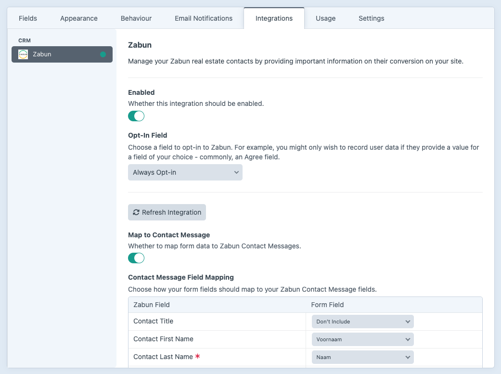

# Formie Zabun Integration

[](https://packagist.org/packages/esign/craft-formie-zabun-integration)
[](https://packagist.org/packages/esign/craft-formie-zabun-integration)

<p align="center"></p>

A [Zabun](https://zabun.be) integration that extends the [Formie](https://verbb.io/craft-plugins/formie/features) plugin for Craft CMS.

## Requirements

This plugin requires:
- Craft CMS 5.0.0 or later
- PHP 8.2 or later
- Formie plugin installed and enabled

## Installation

You can install this plugin from the Plugin Store or with Composer.

### From the Plugin Store

Go to the Plugin Store in your project’s Control Panel and search for “Formie Zabun Integration”. Then press “Install”.

### With Composer

Open your terminal and run the following commands:

```bash
# go to the project directory
cd /path/to/my-project.test

# tell Composer to load the plugin
composer require esign/craft-formie-zabun-integration

# tell Craft to install the plugin
./craft plugin/install formie-zabun
```

## Usage

### Setting Up the Zabun Integration

1. Navigate to Formie > Settings > CRM
2. Click "new integration"
3. Select 'Zabun' as your integration provider
4. Enter your Zabun credentials and save the integration
5. After saving, click the refresh button to verify the API connection

### Sending Form Submissions to Zabun

1. Go to the form you want to connect with Zabun
2. Navigate to the Integrations tab
3. Enable your Zabun integration
4. Map your form fields:
   - Map to Contact Message for user messages
   - Map to Contact Request for user property requests

## API Documentation

For more information about the Zabun API, refer to the [Zabun API documentation](https://gateway-cmsapi.v2.zabun.be/swagger/index.html?urls.primaryName=Zabun+1+CmsApi+-+v1).

## License

This plugin is licensed under the MIT License. Please see [License File](LICENSE.md) for more information.

## Screenshot

